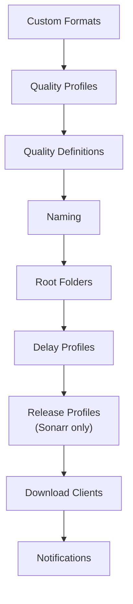

# Sync Order

configarr processes services and resources in a **fixed order that you cannot
change from the YAML**. The order comes from an internal provider registry. It
exists so that one load-bearing dependency is always satisfied: within an *arr
instance, **custom formats are synced before quality profiles**, so a profile's
`custom_format_scores` can reference a format defined in the same file.

## Order across services

The registry is ordered **by resource kind, interleaving Radarr and Sonarr**, then
Prowlarr, then SABnzbd, then Bazarr. It is *not* "all of Radarr, then all of Sonarr":
for example every instance's custom formats and quality profiles are synced (Radarr
then Sonarr) *before* any quality definitions. The authoritative order is the
`REGISTRY` list in `configarr/registry.py`.

> [!NOTE]
> Don't rely on the cross-service or cross-kind ordering — it's an implementation
> detail that can change. The **only** guarantee is the one below: within a Radarr or
> Sonarr instance, custom formats are synced before quality profiles.

## Order within a Radarr / Sonarr instance

Resources are synced top to bottom:

The only ordering that is load-bearing:

> [!TIP]
> **Custom formats before quality profiles**
>
> Custom formats are always synced **before** quality profiles. That's why a quality
> profile's `custom_format_scores` can reference a custom format defined in the same
> file — the format already exists by the time the profile is written. A score that
> references an unknown format is skipped with a warning.

## Order within other services

| Service | Order |
|---|---|
| **Prowlarr** | Indexers → Applications → Download Clients |
| **SABnzbd** | Servers → Categories → Misc Settings |
| **Bazarr** | General Settings → Sonarr Connection → Radarr Connection → Providers → Language Profiles |

## Practical implications

- **Cross-instance references resolve by address, not order.** A Prowlarr
  application pointing at Sonarr uses Sonarr's URL/API key — it doesn't require
  Sonarr to be configured first in the same run. Likewise an *arr SABnzbd download
  client just names a category string; it does not depend on SABnzbd running first
  (SABnzbd is synced *after* the *arr apps, not before).
- **A single file is enough.** Because ordering is handled for you, you can define
  SABnzbd categories, *arr download clients, and Prowlarr apps all in one
  `configarr.yml` and run it once.
- **You can't reorder via YAML.** If you need a different order (rare), split the
  work into multiple files/runs and use [scoping](dry-run-and-scoping.md).
