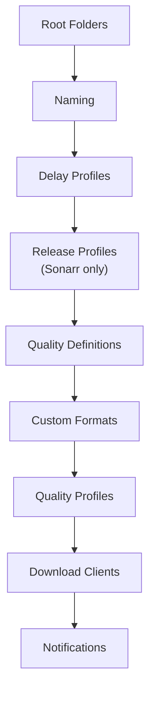

# Sync Order

configarr processes services and resources in a **fixed order that you cannot
change from the YAML**. The order exists so that resources which depend on each
other are created in the right sequence — for example, a SABnzbd category exists
before a Sonarr download client points at it.

## Order across services

SABnzbd runs **first** so its categories exist before the *arr download clients
reference them. Bazarr runs **last** so the Sonarr/Radarr it connects to are
already configured.

> [!NOTE]
> All configured instances of a service are processed before moving to the next
> service. Within a service, instances run in the order they appear in the file.

## Order within a Radarr / Sonarr instance

Resources are synced top to bottom:

The key dependency here:

> [!TIP]
> **Custom formats before quality profiles**
>
> Custom formats are always synced **before** quality profiles. That's why a quality
> profile's `custom_format_scores` can reference a custom format defined in the same
> file — the format already exists by the time the profile is written. A score that
> references an unknown format is skipped with a warning.

## Order within other services

| Service | Order |
|---|---|
| **Prowlarr** | Indexers → Applications → Download Clients |
| **Bazarr** | General Settings → Sonarr Connection → Radarr Connection → Providers → Language Profiles |
| **SABnzbd** | Servers → Categories → Misc Settings |

## Practical implications

- **Cross-instance references resolve by address, not order.** A Prowlarr
  application pointing at Sonarr uses Sonarr's URL/API key — it doesn't require
  Sonarr to be configured first in the same run. But the SABnzbd-first ordering
  *does* matter for categories, which is why it's hardcoded.
- **A single file is enough.** Because ordering is handled for you, you can define
  SABnzbd categories, *arr download clients, and Prowlarr apps all in one
  `configarr.yml` and run it once.
- **You can't reorder via YAML.** If you need a different order (rare), split the
  work into multiple files/runs and use [scoping](dry-run-and-scoping.md).
